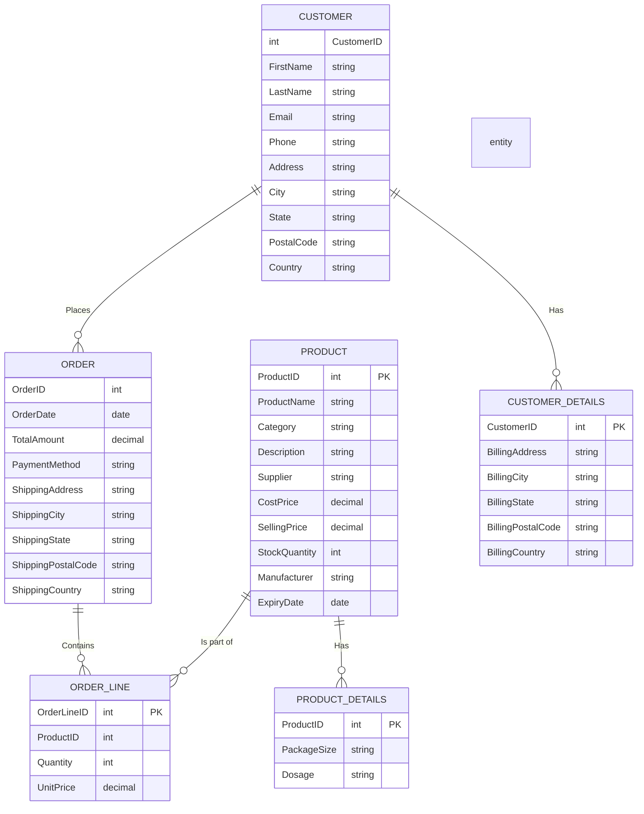

# engenharia_dados

```mermaid
erDiagram
  CUSTOMER ||--o{ ORDER : "Places"
  ORDER ||--o{ ORDER_LINE : "Contains"
  PRODUCT ||--o{ ORDER_LINE : "Is part of"
  CUSTOMER ||--o{ CUSTOMER_DETAILS : "Has"
  PRODUCT ||--o{ PRODUCT_DETAILS : "Has"

  entity CUSTOMER {
    int CustomerID   
    FirstName string
    LastName string
    Email string
    Phone string
    Address string
    City string
    State string
    PostalCode string
    Country string
  }

  entity ORDER {
    OrderID int    
    OrderDate date
    TotalAmount decimal
    PaymentMethod string
    ShippingAddress string
    ShippingCity string
    ShippingState string
    ShippingPostalCode string
    ShippingCountry string
  }

  entity ORDER_LINE {
    OrderLineID int PK
    ProductID int
    Quantity int
    UnitPrice decimal
  }

  entity PRODUCT {
    ProductID int PK    
    ProductName string
    Category string
    Description string
    Supplier string
    CostPrice decimal
    SellingPrice decimal
    StockQuantity int
    Manufacturer string
    ExpiryDate date
  }

  entity CUSTOMER_DETAILS {
    CustomerID int PK    
    BillingAddress string
    BillingCity string
    BillingState string
    BillingPostalCode string
    BillingCountry string
  }

  entity PRODUCT_DETAILS {
    ProductID int PK
    
    PackageSize string
    Dosage string

  }


```
